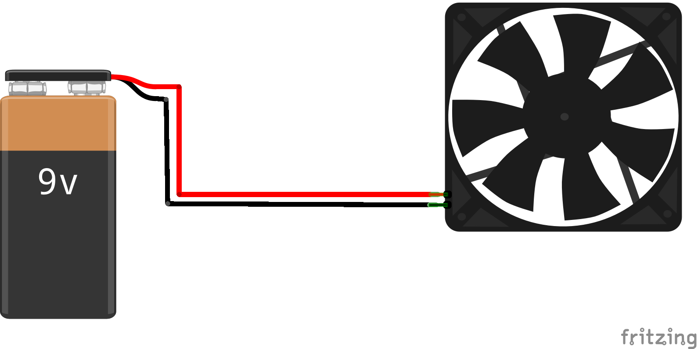
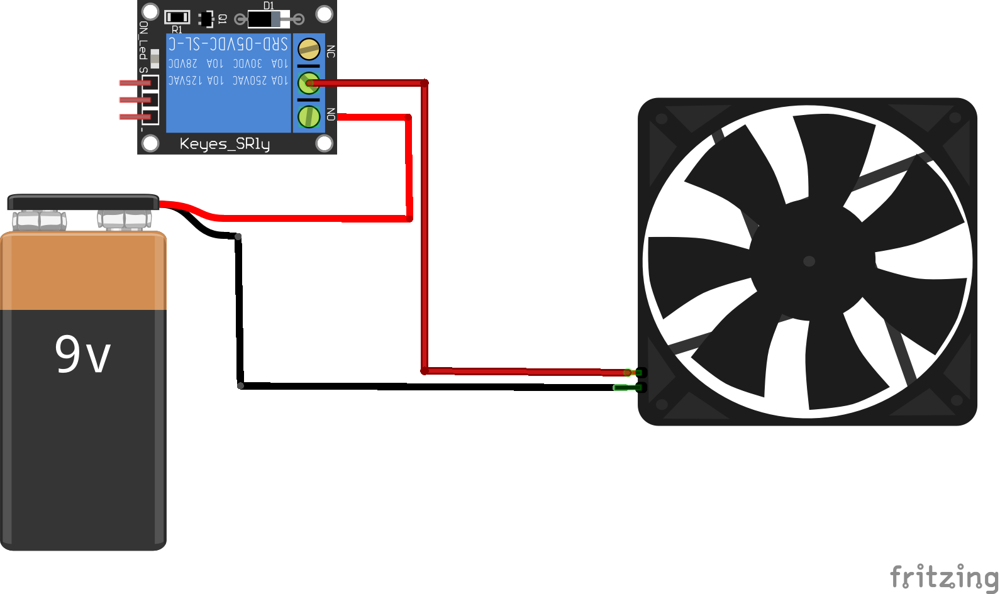

Assembling the Smart Greenhouse
====================================

Assembling the smart greenhouse is very simple. Use the following two steps:

Step 1. Connect the grove devices to the WioLink board
--------------------------------------------------------

You will need these devices connected to the following ports:

* A :ref:`relay`: Connected to Port 1
* A :ref:`servo`: Connected to Port 2
* A :ref:`temp_sensor_pro`: Connected to Port 3
* An :ref:`grow_light`: Connected to Port 5
* An I2C hub or branch cable: Connected to Port 6
* An :ref:`oled`: Connected to the I2C hub or branch cable
* A :ref:`light_sensor`: Connected to the I2C hub or branch cable

Step 2. Assemble parts controlled by the relay (fan/pump)
-----------------------------------------------------------

You will need the following parts controlled by the relay

* A 12V ventilation fan (40mm x 40mm) or a 12V water pump
* A 9V battery with clip
* A Wire stripper
* Tape

.. rubric:: How to connect the fan/pump to the relay

First, cut off the two pin connector on the fan. Remove the protective material from the wires and expose the copper wires with the wire stripper. Now, if you connect the red and black wires to the corresponding wires on the 9V battery clip, the fan will spin:

Now, think of the relay as a regular switch.  Keep the black wires connected (you might want to tape it. Insert the red wire from the fan to one terminal of the relay (Either one will work. You might want to loosen the retention screws first) and the red wire from the battery clip to the other. This way, when the relay is activated, the circuit will be closed, and the fan will start to spin.

Step 3. Software installation
------------------------------------

Use the link below to download `main.py` (right click on the link -> save target as `main.py`). Use EsPy's file manager to upload the file to the WioLink board. Alternatively, you can copy the code below and create a new file called `main.py` in EsPy. Save the file and use the upload button to upload it to the WioLink board. Either way, when you are finished, simply press the reset button. The board should start to work after 5 seconds.

.. rubric:: Download Links:

* `main.py <https://raw.githubusercontent.com/digicosmos86/wiolink/master/main.py>`_