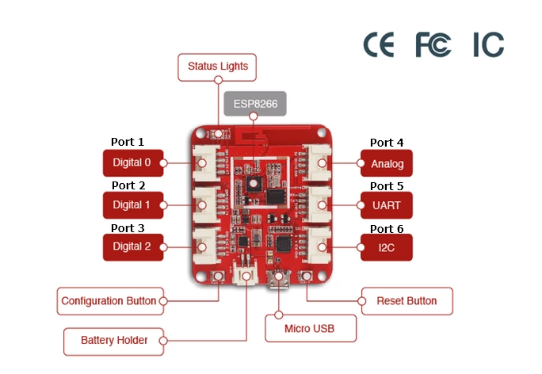
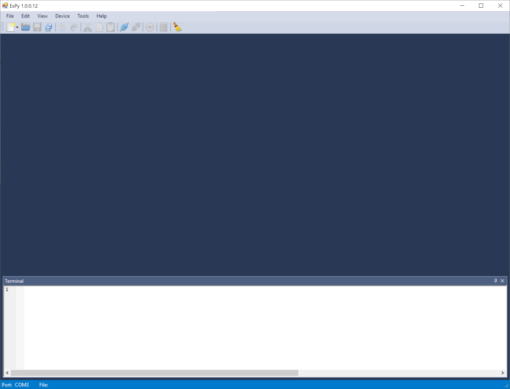
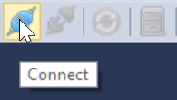
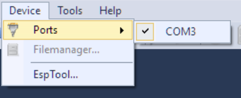
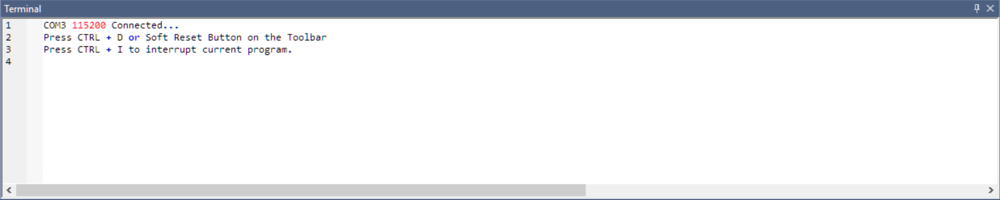
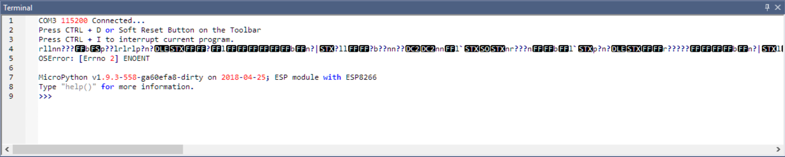
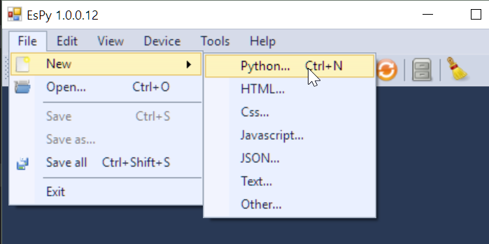

.. _quickstart:

Quickstart Guide
=================================

This guide assumes that you have the software environment already configured. If not, please follow the :ref:`wiolink` before proceeding.

1. Hardware for the Smart Greenhouse
---------------------------------------

The red development board that we are using for building the GrowThings smart greenhouse is called the Wio Link board developed by `SeeedStudio <http://seeedstudio.com>`_, a Chinese company that develops many electronic devices. The board is based on ESP8266, a $4 microcontroller chip with built-in WiFi for Internet of Things development. A microcontroller features a simpler structure than a microcomputer like Raspberry Pi. Therefore, they are typically smaller and less expensive than a microcomputer, but consumes far less energy. They do not require an operating system, which allows developers to communicate with hardware directly.

**MicroUSB and Battery Ports**: The image above shows the Wio Link board. At the bottom of the board is a microUSB port used to connect the board to the computer. To the left of the microUSB port is the battery port. The Wio Link board can be powered through the microUSB port and a 3.7v rechargeable Li-Po battery. Like how most smartphones work, connecting the board to USB charges the battery.

**Config and Reset Buttons**: Two buttons lay on both sides of the board. These are the config button on the left, and the reset button on the right.  The reset button on the right is more often used, whose purpose is to restart the board.

**LED Indicators**: With the microUSB port facing down, this is the upright position for the board, as depicted in the picture above. There is a blue and a red LED on the top-left of the board. The former is the WiFi indicator and the latter the power indicator. Please ensure that the power LED is on when programming the board. Otherwise the board is not powered properly and some devices, such as the light sensor, might not function properly. There is also a green battery indicator showing the status of the rechargeable battery. It will blink if battery is not found, and remain on if battery is being charged.

**Grove Ports**: 6 grove ports can be found on both sides of the board. With the board in its upright position, these ports are numbered, from top to bottom and from left to right, ports 1 through 6. It is through these ports that the board is connected to other grove compatible devices. Please remember the numbers for these ports as we will need these numbers to tell the microcontroller which device is connected to which port.

2. The Software Development Environment
------------------------------------------

We are going to use the **EsPy** Integrated Development Environment (IDE) to program the Wio Link board. An IDE not only allows us to program the board, it also flashes the firmware and manages the files on the board. Please go to the EsPy folder (might be named ``Release``), and run ``EsPy.exe`` (it is a good idea to create a desktop shortcut to it). The program looks like the following:

.. hint::

    If an error pops up and says .Net Framework is required or needs update, please follow the link below and install the latest version of the .Net Framework. EsPy is written in C# which requires .Net Framework runtime.

    `Microsoft .net Framework (Required for Windows 7, 8, 8.1, Optional for Windows 10) <https://www.microsoft.com/net/download/dotnet-framework-runtime>`_

Like most Windows applications, this program has a menu bar, a toolbar, a main scripting window, and a terminal window. at the bottom of the screen. These four rightmost buttons on the toolbar are very important (see below). They are ``Connect``, ``Disconnect``, ``Soft Reset``, and ``File Manager``. The terminal serves two functions. First, it communicates directly with the Wio Link board and monitors the status of the board. Second, it passes code to the board for it to execute. In other words, we can directly write code in the terminal, after the ``>>>`` prompt, and when we hit enter, the code will be directly executed and we can see the results immediately.

To get started with programming with MicroPython on the Wio Link board, first connect to the board to one of the USB ports on the computer. Then, go to ``Device->Ports``, and make sure a COM port (which could be "COM" followed by any number) is selected:

Next, click the ``Connect`` button on the toolbar. You will see this message in the terminal:

Now, reset the board either by pressing the "reset" button on the board, hitting ``Ctrl+D``, or clicking the ``Soft Reset`` button on the toolbar. You will then see a ``>>>`` prompt in the terminal window at the bottom of the screen:

Congratulations! Your Wio Link board is ready to be programmed.

3. Programming the Wio Link board with MicroPython
-----------------------------------------------------

The programming language that we are using to program the Wio Link board is called MicroPython, which is a subset of Python 3.5. It is a beginner-friendly yet powerful language.

Now let's program the Wio Link board. Remember that microcontrollers are computers too, so their basic function is to do math. You can write arbitrary math expressions in the terminal, hit enter, and the computer will do the calculation for you. The operators for addition, subtraction, multiplication, division, and exponentiation are ``+``, ``-``, ``*``, ``/``, and ``**``:

    >>> 124+325
    >>> 354 *   237
    >>> 1000 /50
    >>> 100**100

Python can compute as large numbers as the memory would allow. Also, note that Python generally ignores spaces, so both ``123+456`` and ``123 +  456`` will work, but it's a good idea to properly use spaces to improve the readability of the code.

Can Python do square roots? Yes, but the **base** Python only supports basic operations. Therefore, we need some extra help in order to do more complicated math. Python has a built-in **module** called :mod:`math` that provides additional math operations. All you need to do is to **import** the **module**.

    >>> import math

After importing the module, in order to call the functions within the module, you need to use the **dot** notation:

    >>> math.sqrt(625)
    25.0
    >>> math.cos(0)
    1.0

The dot notation here means call the ``sqrt()`` function within the :mod:`math` module, so the Python knows where to look for the ``sqrt()`` function. A function in Python is very similar to functions in math. It has a name followed by a set of parentheses, similar to ``f(x)`` in maths. Function **arguments** are passed between the parentheses, and the function will do the operation and **return** a value, in this case, the square root of 625, which is 25.0. However, if you only write:
   
    >>> import math
    >>> sqrt(625)
    Traceback (most recent call last):
    File "<stdin>", line 1, in <module>
    NameError: name 'sqrt' is not defined

Python will still not know where to look for it, and then report an error and complain that it cannot find the ``sqrt()`` function.  However, if you will frequently use the ``sqrt()`` function, there is a way to avoid typing ``math`` all the time:

    >>> from math import sqrt
    >>> sqrt(625)
    25.0

Python modules are one of the most powerful features in Python. There are thousands of Python modules available, written by a vibrant community, which enables Python to do anything you can imagine. We will be using modules all the time.

4. Device Programming with MicroPython
-------------------------------------------

Programming the electronic devices follows three simple steps:

1. Import the corresponding class for the device
2. Create a virtual shortcut to the device
3. Control the devices using the built in functions for that class

1. Import the corresponding class
^^^^^^^^^^^^^^^^^^^^^^^^^^^^^^^^^^

Let us use the :ref:`temp_sensor` connected to Port 3 as an example.  Type the following in the Terminal.

>>> from sensors import TemperatureSensor

Now you should be pretty familiar with ``from module import Class`` syntax. Here are a few rules to help you find the classes easily and prevent errors:

:mod:`sensors` is the name of the module, which is always in all lowercase ending with an "s." There are three modules available: :mod:`sensors`, :mod:`actuators`, and :mod:`displays`. Within each module you will find the classes available for your device. Refer to the table below to locate your class, which is always in `CamelCase <https://en.wikipedia.org/wiki/Camel_case>`_. Python is a case sensitive language and it is important to make sure that you write the code with the correct case.

.. rubric:: Optional: What is a class?

In Object-Oriented Programming. A **class** is blueprint for creating **objects**. The following diagram explains the relationship between **classes** and **objects**.

.. image:: https://ds055uzetaobb.cloudfront.net/image_optimizer/722c82aff075a14313be7fa7463f7fedad151a0a.png

In this case, the TemperatureSensor is a class, and we know that all TemperatureSensors built this way behave in a certain way, but we need to create an object specifically for the specific one that is connected to Port 3. Therefore, we need the second step:

2. Create an object referring to the sensor
^^^^^^^^^^^^^^^^^^^^^^^^^^^^^^^^^^^^^^^^^^^^^^^^

Create an object of the class ``TemperatureSensor`` referring to the sensor at Port 3 like this:

>>> temp_sensor = TemperatureSensor(port=3)

or 

>>> temp_sensor = TemperatureSensor(3)

Now Python knows there is a temperature sensor connected at port 3. We have even given it a name ``temp_sensor``. This is just an alias, or a nickname, for us to remember. Think of it as a shortcut. Next time we want to refer to the temperature sensor at port 3, we can use the name, and Python will know we want to communicate with the temperature sensor at port 3.

3. Interact with the devices using the objects
^^^^^^^^^^^^^^^^^^^^^^^^^^^^^^^^^^^^^^^^^^^^^^^^^^^

Each class offers a set of functionalities for interacting with the devices. In this case, the ``TemperatureSensor`` class offers ``TemperatureSensor.get_temperature()`` and ``TemperatureSensor.get_humidity()`` methods. To use these methods, simply use the **dot notation** to access the methods:

    >>> temp_sensor.get_temperature()
    >>> temp_sensor.get_humidity()

Please refer to the :ref:`api` for more information on how to use these classes.

4. Control one device with another
^^^^^^^^^^^^^^^^^^^^^^^^^^^^^^^^^^^^^^^^^^^

Now connect a button to Port 1 and an LED strip to Port 2. Since now we need to write a more complicated program, we switch to scripting. Click ``File->New->Python`` to create a new Python script, or hit ``Ctrl+N``. Name the new file as ``test.py``:

Initialize them with the following code. Note that the LED strip is a display and the button is an actuator.

.. code-block:: python

    # import classes
    
    from displays import GrowLight
    from actuators import Button

    # create shortcuts

    button = Button(port=1)
    gl = GrowLight(port=2)

    while True:          # an infinite loop
        if b.is_pressed: # determine if the button is pressed
            gl.on()      # turns the led strip on if button is pressed
        else:
            gl.off()     # turns the led strip off if button not pressed

This simple program loops forever. It will constantly determine if the button is pressed, and turns the LED strip on if it is, and off if it is not.

.. hint::

    The pound or hashtag sign ``#`` indicates that the subsequent text on the same line is comments. Comments are used for programmers to communicate with themselves or other programmers what they are doing with the code. They are greyed out and Python will not consider them as part of the program.
